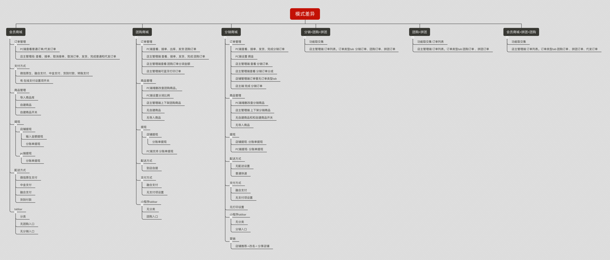
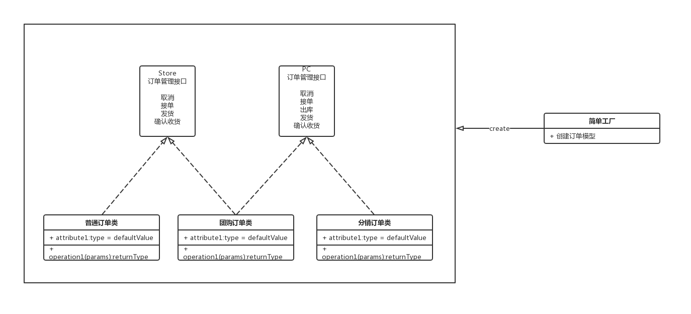
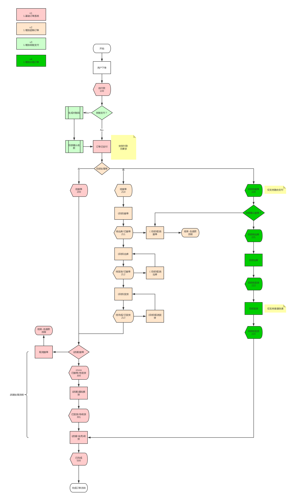
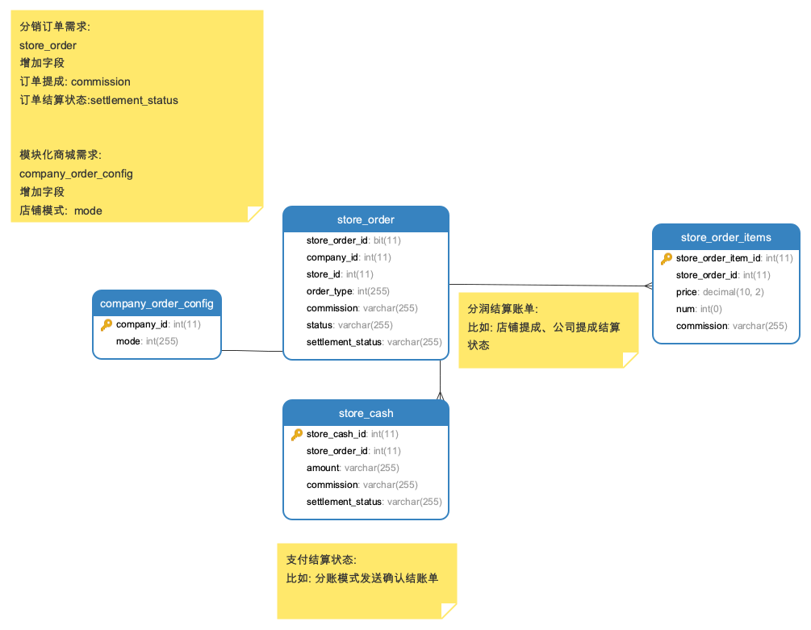

# 引言

## 编写目的

本文档阐述了 直店引入分销订单，分销订单的解决方案和实现原理。以及模块化需求的实施要点，保证系统稳定以及系统的可持续开发性和相关人员对系统、业务逻辑、架构的掌握。

## 引用术语

|名称|说明|
|:-:|:-:|
|简单工厂模式|创建型模式，是由一个工厂对象决定创建出哪一种产品类的实例|
|单例模式|常用设计模式，保证一个类仅有一个实例，并提供一个访问它的全局访问点。订单管理使用一个订单单例模型。|
|位运算|二进制位运算符用于直接对二进制位进行计算。直接处理每一个比特位（bit），所以是非常底层的运算，好处是速度极快，缺点是很不直观，许多场合不能使用它们，否则会使代码难以理解和查错。|
|分销订单|总部负责处理订单.店铺选择上架总部商品，自己负责渠道销售商品，获取提成的订单模式。|

## 版本控制

### 文档信息

|文档准备人:|成元龙|
|:-:|:-:|
|准备日期:|2019-06-06|
|审阅人:|毛飞、李政林|
|审阅日期:|2019-06-13|

### 版本历史

|日期|版本号|作者|说明|
|:-:|:-:|:-:|:-:|
|2019-06-12|1.0.0|成元龙|完成初版|

### 分发列表

|编号|姓名|职位|组织|
|:-:|:-:|:-:|:-:|
|0x00|李政林|架构师|DHB|
|0x01|毛飞|Master|破冰|

# 系统总体架构

## 项目背景

需求背景: 分销订单、 模块化订单

技术背景: 普通订单、代发订单、团购订单、分销订单、拼团订单逻辑糅合在一个订单模型中, 逻辑不清晰, 变动影响范围大。

## 技术框架

### 订单管理部分

使用简单工厂模式,
将订单操作抽象为 Store端订单管理借口, PC端订单管理接口; `普通订单、代发订单` 实现 `Store端订单管理接口`。

`分销订单` 实现 `PC端订单管理接口`。 

`团购订单` 同时实现 `Store端订单管理接口` 和 `PC端订单管理接口`。

工厂类根据基础模型创建 对应订单类。并绑定为 `Laravel` 容器中的一个单例。使用 `getOriginAttribute` 获取原始字段值。

### 模块化

直店根据商城拥有订单(促销)类型, 将上游拆成 `会员商城`、`团购商城`、`分销商城`、`拼团商城`。

模式定义:

采用二进制位开关做定义。 
第一位代表会员商城是否启用。
第二位代表团购商城是否启用。
第三位代表分销商城是否启用。
第四位代表拼团商城是否启用。
新增加的促销订单模块。依次递增。

由此产生的状态定义如下表

|名称|启用二进制|启用十进制|
|:--:|:--:|:--:|:--:|
|会员商城|0001|1|
|团购商城|0010|2|
|分销商城|0100|4|
|拼团商城|1000|8|
|分销+拼团+团购|1100|12|
|团购+拼团|0110|6|
|会员商城+拼团+团购|1011|11|

数据库中存储对应的 10 进制状态码。

在登录的时候, Api返回对应的店铺模式。由前端根据 上游 店铺模式判断页面元素展示与否和响应的前端逻辑。

## 模块功能差异图



### 判断店铺模式 参考方法

```javascript
//javascript代码
const MEMBER_STORE = 1;
const DISTRIBUTION_STORE = 4;
const GROUP_STORE  = 2;

if(MEMBER_STORE & mode){
    //会员商城模式
}

if(DISTRIBUTION_STORE & mode){
    //分销商城模式
}

if(GROUP_STORE & mode){
    //团购商城模式
}
```

## 系统总体架构

### 订单管理UML



### 整体业务逻辑架构图



### ER图



### 数据字典

`store_order` 表

|字段|类型|空|默认|说明|
|:--:|:--:|:--:|:--:|:--:|
|store_order_id|int(11)|N|||订单主键|
|commission|int(11)|N|0|订单分润金额|
|settlement_status|tinyint|N|10|10待结算;20已结算|

`company_order_id` 表

|字段|类型|空|默认|说明|
|:--:|:--:|:--:|:--:|:--:|
|company_id|int(11)|N|||公司id|
|mode|int(11)|N|0|店铺模式|

# 引用 

> [php位运算](https://www.php.net/manual/zh/language.operators.bitwise.php)
>  
> [javascript位操作-阮一峰博客-9.开关作用](https://wangdoc.com/javascript/operators/bit.html)
