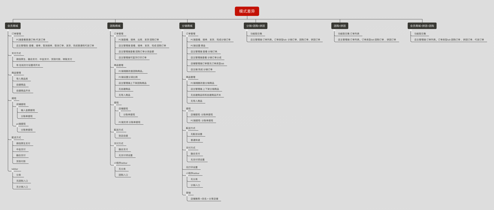
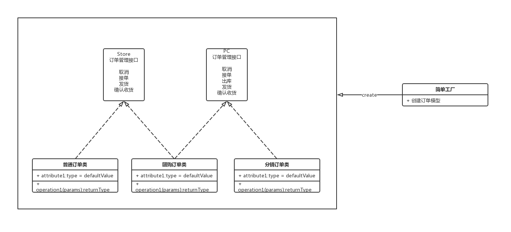
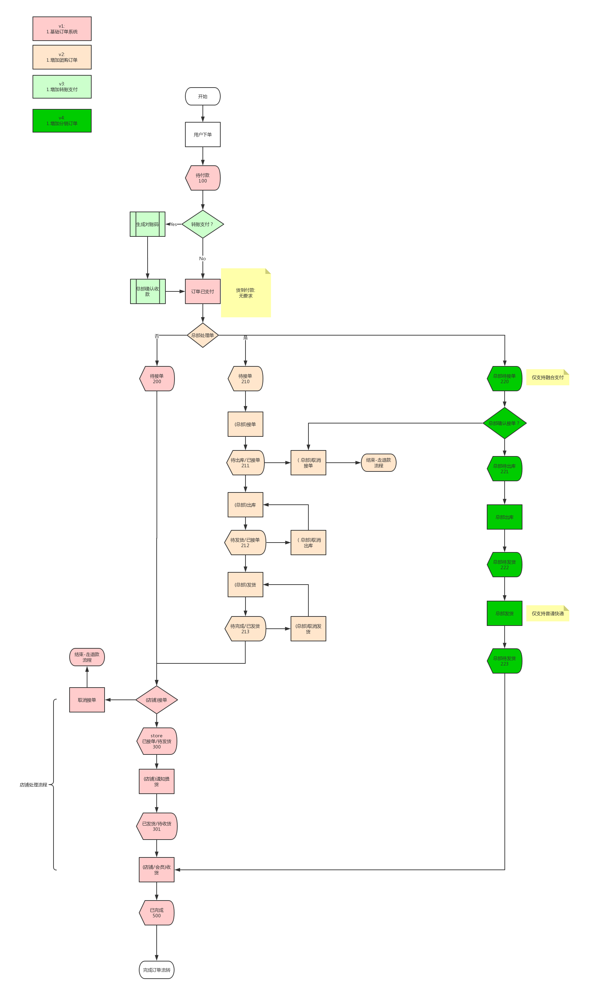
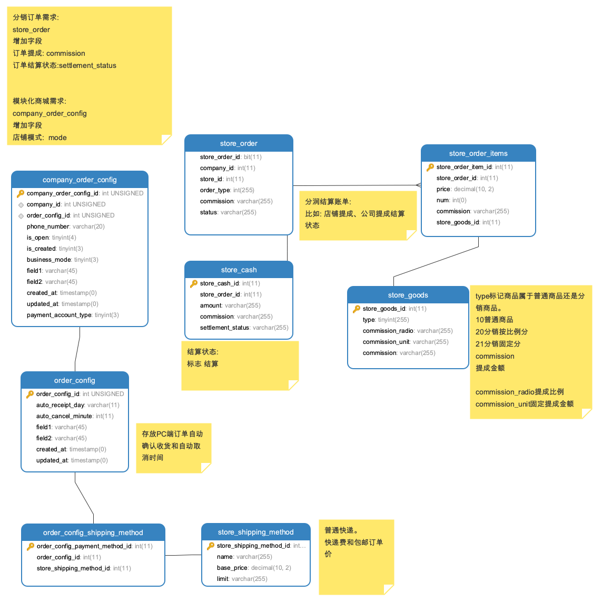

# 引言

## 更新记录

### v1.0.0

定稿

### v1.0.1

- 增加PC端订单配置实现
- 增加变动范围
- 增加完整数据字典

## 编写目的

本文档阐述了 直店引入分销订单，分销订单的解决方案和实现原理。以及模块化需求的实施要点，保证系统稳定以及系统的可持续开发性和相关人员对系统、业务逻辑、架构的掌握。

## 引用术语

|名称|说明|
|:-:|:-:|
|简单工厂模式|创建型模式，是由一个工厂对象决定创建出哪一种产品类的实例|
|单例模式|常用设计模式，保证一个类仅有一个实例，并提供一个访问它的全局访问点。订单管理使用一个订单单例模型。|
|位运算|二进制位运算符用于直接对二进制位进行计算。直接处理每一个比特位（bit），所以是非常底层的运算，好处是速度极快，缺点是很不直观，许多场合不能使用它们，否则会使代码难以理解和查错。|
|分销订单|总部负责处理订单.店铺选择上架总部商品，自己负责渠道销售商品，获取提成的订单模式。|

## 版本控制

### 文档信息

|文档准备人:|成元龙|
|:-:|:-:|
|准备日期:|2019-06-06|
|审阅人:|毛飞、李政林|
|审阅日期:|2019-06-13|

### 版本历史

|日期|版本号|作者|说明|
|:-:|:-:|:-:|:-:|
|2019-06-12|1.0.0|成元龙|完成初版|
|2018-06-14|1.0.1|成元龙|增加变动范围、完整数据字典|

### 分发列表

|编号|姓名|职位|组织|
|:-:|:-:|:-:|:-:|
|0x00|李政林|架构师|DHB|
|0x01|毛飞|Master|破冰|

## 系统总体架构

### 项目背景

需求背景: 分销订单、 模块化订单

技术背景: 普通订单、代发订单、团购订单、分销订单、拼团订单逻辑糅合在一个订单模型中, 逻辑不清晰, 变动影响范围大。

### 技术框架

#### 订单管理部分

使用简单工厂模式,
将订单操作抽象为 Store端订单管理借口, PC端订单管理接口; `普通订单、代发订单` 实现 `Store端订单管理接口`。

`分销订单` 实现 `PC端订单管理接口`。 

`团购订单` 同时实现 `Store端订单管理接口` 和 `PC端订单管理接口`。

工厂类根据基础模型创建 对应订单类。并绑定为 `Laravel` 容器中的一个单例。使用 `getOriginAttribute` 获取原始字段值。

#### 模块化

直店根据商城拥有订单(促销)类型, 将上游拆成 `会员商城`、`团购商城`、`分销商城`、`拼团商城`。

模式定义:

采用二进制位开关做定义。 
第一位代表会员商城是否启用。
第二位代表团购商城是否启用。
第三位代表分销商城是否启用。
第四位代表拼团商城是否启用。
新增加的促销订单模块。依次递增。

由此产生的状态定义如下表

|名称|启用二进制|启用十进制|
|:--:|:--:|:--:|:--:|
|会员商城|0001|1|
|团购商城|0010|2|
|分销商城|0100|4|
|拼团商城|1000|8|
|分销+拼团+团购|1100|12|
|团购+拼团|0110|6|
|会员商城+拼团+团购|1011|11|

数据库中存储对应的 10 进制状态码。

获取模块API

```json
{
	"status": "T",
	"data": {
		"mode": 6
	}
}
```

在登录的时候, Api返回对应的店铺模式。由前端根据 上游 店铺模式判断页面元素展示与否和响应的前端逻辑。

#### 判断店铺模式 参考方法

```javascript
//javascript代码
const MEMBER_STORE = 1;
const DISTRIBUTION_STORE = 4;
const GROUP_STORE  = 2;

if(MEMBER_STORE & mode){
    //会员商城模式
}

if(DISTRIBUTION_STORE & mode){
    //分销商城模式
}

if(GROUP_STORE & mode){
    //团购商城模式
}
```

### 模块功能差异图



### 系统总体架构

#### 订单管理UML



#### 整体业务逻辑架构图



#### ER图



#### 完整数据字典

`company_order_config` 

|名称|类型|空|键|默认|补充|说明|
|:--:|:--:|:--:|:--:|:--:|:--:|:--:|
|company_order_config_id|int(10) unsigned|NO|PRI||auto_increment||
|company_id|int(10) unsigned|NO|MUL|0||公司id|
|order_config_id|int(10) unsigned|NO|MUL|0||订单配置 id|
|phone_number|varchar(20)|NO||||公司收款账户 开户手机号|
|is_open|tinyint(4)|NO||0||是否开通 1：开通  0：未开通|
|is_created|tinyint(3)|NO||0||是否已经开通收款账户 1：开通 0：未开通|
|business_mode|tinyint(3)|NO||1||业务模式 1：店铺收款  店铺发货  2：总部收款 总部发货 3：总部收款 店铺发货|
|field1|varchar(45)|NO||||备用字段|
|field2|varchar(45)|NO||||备用字段2|
|created_at|timestamp|NO||CURRENT_TIMESTAMP|on update CURRENT_TIMESTAMP||
|updated_at|timestamp|NO||0000-00-00 00:00:00|||
|payment_account_type|tinyint(3)|NO||10||支付账户类型,设置使用中金支付的时候 10默认模式:普通支付;20分账模式，走分账支付|
|company_order_config_id|int(10) unsigned|NO|PRI||auto_increment||
|company_id|int(10) unsigned|NO|MUL|0||公司id|
|order_config_id|int(10) unsigned|NO|MUL|0||店铺id|
|phone_number|varchar(20)|NO||||公司收款账户 开户手机号|
|is_open|tinyint(4)|NO||0||是否开通 1：开通  0：未开通|
|is_created|tinyint(3)|YES||0||是否已经开通收款账户 1：开通 0：未开通|
|business_mode|tinyint(3)|NO||1||业务模式 1：店铺收款  店铺发货  2：总部收款 总部发货 3：总部收款 店铺发货|
|field1|varchar(45)|NO||||备用字段|
|field2|varchar(45)|NO||||备用字段2|
|created_at|timestamp|NO||0000-00-00 00:00:00|||
|updated_at|timestamp|NO||0000-00-00 00:00:00|||
|payment_account_type|tinyint(3)|NO||10||支付账户类型,设置使用中金支付的时候 10默认模式:普通支付;20分账模式，走分账支付|
|commission_radio|varchar(45)|NO||0||分销比例|
|mode|tinyint(255)|NO||1||店铺模块:  1.会员商城;2.团购商城. 4 分销商城.8拼团商城;|
|create_user|int(11) |NO||0||创建记录用户|
|last_update_user|int(11) |NO||0||更新记录用户|
|deleted|tinyint(1) |NO||0||软删除记录|
`order_config` 

|名称|类型|空|键|默认|补充|说明|
|:--:|:--:|:--:|:--:|:--:|:--:|:--:|
|order_config_id|int(10) unsigned|NO|PRI||auto_increment||
|auto_receipt_day|int(11)|NO||7||自动收货天数 默认7天|
|auto_cancel_minute|int(11)|NO||30||订单超时自动取消时间 默认30|
|field1|varchar(45)|NO||||备用字段|
|field2|varchar(45)|NO||||备用字段2|
|created_at|timestamp|NO||CURRENT_TIMESTAMP|on update CURRENT_TIMESTAMP||
|updated_at|timestamp|NO||0000-00-00 00:00:00|||
|order_config_id|int(10) unsigned|NO|PRI||auto_increment||
|auto_receipt_day|varchar(11)|NO||7||自动收货天数 默认7天|
|auto_cancel_minute|int(11)|NO||30||订单超时自动取消时间 默认30|
|field1|varchar(45)|NO||||备用字段|
|field2|varchar(45)|NO||||备用字段2|
|created_at|timestamp|NO||0000-00-00 00:00:00|||
|updated_at|timestamp|NO||0000-00-00 00:00:00|||
|create_user|int(11) |NO||0||创建记录用户|
|last_update_user|int(11) |NO||0||更新记录用户|
|deleted|tinyint(1) |NO||0||软删除记录|

`store_cash` 

|名称|类型|空|键|默认|补充|说明|
|:--:|:--:|:--:|:--:|:--:|:--:|:--:|
|store_cash_id|int(10) unsigned|NO|PRI||auto_increment|店铺资金表主键|
|company_id|int(10) unsigned|NO|MUL|0||公司id|
|store_id|int(10) unsigned|NO|MUL|0||店铺id|
|store_member_id|int(10) unsigned|NO|MUL|0||会员id|
|store_order_id|int(10) unsigned|NO||0||订单ID|
|serial_number|varchar(45)|NO|UNI|||流水号|
|amount|int(11)|NO||0||入账金额|
|actual_amount|int(11)|NO||0||实际到账金额|
|poundage|int(10) unsigned|NO||0||手续费|
|commission|int(10) unsigned|NO||0||总部分润金额|
|store_payment_method_id|int(11)|NO||0||支付方式ID|
|type|int(11)|NO||0||101在线支付-原生微信; 102货到付款;103中金支付;2xx对应1xx的退款状态|
|from_account|varchar(30)|NO||||出款账户UID|
|to_account|varchar(30)|NO||||入款账户UID|
|status|tinyint(4)|NO||10||转账支付状态: 0->待确认;10 -> 支付成功; 20 -> 支付失败|
|store_order_transaction_id|int(11)|NO||0||交易ID|
|field1|varchar(45)|NO||||备用字段|
|field2|varchar(45)|NO||||备用字段2|
|created_at|timestamp|NO||1971-01-01 00:00:00||记录创建时间|
|updated_at|timestamp|NO||1971-01-01 00:00:00||记录更新时间|
|account_type|tinyint(3)|NO||10||支付账户类型:10普通模式;20分账模式|
|logic_settlement_status|tinyint(3)|NO||10||逻辑结算状态: 10待结算;20已结算|
|settlement_status|tinyint(3)|NO||10||结算状态: 10待结算;20已结算|
|store_cash_id|int(10) unsigned|NO|PRI||auto_increment|店铺资金表主键|
|company_id|int(10) unsigned|NO|MUL|0||公司id|
|store_id|int(10) unsigned|NO|MUL|0||店铺id|
|store_member_id|int(10) unsigned|NO|MUL|0||会员id|
|store_order_id|int(10) unsigned|NO||0||订单ID|
|serial_number|varchar(45)|NO|UNI|||流水号|
|amount|int(11)|NO||0||入账金额|
|actual_amount|int(11)|NO||0||实际到账金额|
|poundage|int(10) unsigned|NO||0||手续费|
|commission|int(10) unsigned|NO||0||总部分润金额|
|store_payment_method_id|int(11)|NO||0||支付方式ID|
|type|int(11)|NO||0||101在线支付-中金; 102在线支付-微信原生;103货到付款;2xx对应1xx的退款状态|
|from_account|varchar(30)|NO||||出款账户UID|
|to_account|varchar(30)|NO||||入款账户UID|
|status|tinyint(4)|NO||10||转账支付状态: 0->待确认;10 -> 支付成功; 20 -> 支付失败|
|store_order_transaction_id|int(11)|NO||0||交易ID|
|field1|varchar(45)|NO||||备用字段|
|field2|varchar(45)|NO||||备用字段2|
|created_at|timestamp|NO||1971-01-01 00:00:00||记录创建时间|
|updated_at|timestamp|NO||1971-01-01 00:00:00||记录更新时间|
|account_type|tinyint(3)|NO||10||支付账户类型:10普通模式;20分账模式|
|logic_settlement_status|tinyint(3)|NO||10||逻辑结算状态: 10待结算;20已结算|
|settlement_status|tinyint(3)|NO||10||结算状态: 10待结算;20已结算|
|create_user|int(11) |NO||0||创建记录用户|
|last_update_user|int(11) |NO||0||更新记录用户|
|deleted|tinyint(1) |NO||0||软删除记录|

`store_goods` 

|名称|类型|空|键|默认|补充|说明|
|:--:|:--:|:--:|:--:|:--:|:--:|:--:|
|store_goods_id|int(10) unsigned|NO|PRI||auto_increment||
|store_id|int(11)|NO|MUL|0||店铺ID|
|is_multi|tinyint(4)|NO||0||是否为多规格产品|
|putaway|enum('T','F')|NO||F||上下架[T->上架; F->下架]|
|goods_name|varchar(80)|NO||||商品名称|
|goods_mnemonic|varchar(50)|YES||||商品名称首字母|
|goods_model|varchar(50)|YES||||型号规格|
|goods_weight|decimal(10,4)|YES||0.0000||重量|
|goods_picture|varchar(130)|YES||||图片|
|base_units|char(5)|YES||||基本单位|
|base_barcode|varchar(30)|YES||||基本单位条码|
|source|enum('first_time_import','later_added','manually_added')|NO||first_time_import||来源|
|price|decimal(14,4)|NO||0.0000||商品价格[用于商品列表展示]|
|market_price|decimal(14,4)|NO||0.0000||商品市场价格[用于商品列表展示]|
|original_price|decimal(14,4)|NO||0.0000||商品原始价格[用于商品列表展示, 所有规格中价格最低的]|
|source_company_id|int(11)|YES||0||来源公司ID|
|source_goods_id|int(11)|YES||0||来源商品ID|
|is_updated|tinyint(4)|NO||0||是否更新|
|is_deleted|tinyint(4)|NO||0||是否删除|
|created_user|int(11)|NO||0||创建者账号ID|
|updated_user|int(11)|NO||0||更新者账号ID|
|created_at|timestamp|NO||CURRENT_TIMESTAMP|on update CURRENT_TIMESTAMP||
|updated_at|timestamp|NO||0000-00-00 00:00:00|||
|store_goods_id|int(10) unsigned|NO|PRI||auto_increment||
|store_id|int(11)|NO|MUL|0||店铺ID|
|is_multi|tinyint(4)|NO||0||是否为多规格产品|
|putaway|enum('T','F')|NO||F||上下架[T->上架; F->下架]|
|goods_name|varchar(80)|NO||||商品名称|
|goods_mnemonic|varchar(50)|YES||||商品名称首字母|
|goods_model|varchar(50)|YES||||型号规格|
|goods_weight|decimal(10,4)|YES||0.0000||重量|
|goods_picture|varchar(130)|YES||||图片|
|base_units|char(5)|YES||||基本单位|
|base_barcode|varchar(30)|YES||||基本单位条码|
|source|enum('first_time_import','later_added','manually_added')|NO||first_time_import||来源|
|price|decimal(14,4)|NO||0.0000||商品价格[用于商品列表展示]|
|market_price|decimal(14,4)|NO||0.0000||商品市场价格[用于商品列表展示]|
|original_price|decimal(14,4)|NO||0.0000||商品原始价格[用于商品列表展示, 所有规格中价格最低的]|
|source_company_id|int(11)|YES||0||来源公司ID|
|source_goods_id|int(11)|YES||0||来源商品ID|
|is_updated|tinyint(4)|NO||0||是否更新|
|is_deleted|tinyint(4)|NO|MUL|0||是否删除|
|created_user|int(11)|NO||0||创建者账号ID|
|updated_user|int(11)|NO||0||更新者账号ID|
|created_at|timestamp|NO||0000-00-00 00:00:00|||
|updated_at|timestamp|NO||0000-00-00 00:00:00|||
|sales_number|int(11) unsigned|NO||0||销量|
|type|tinyint(4)|NO||10||商品类型;10普通商品;20分销商品|
|commission_unit|decimal(14,0)|NO||0||单件商品分销提成|
|commission_radio|varchar(255)|NO||0||分销比例|
|create_user|int(11) |NO||0||创建记录用户|
|last_update_user|int(11) |NO||0||更新记录用户|
|deleted|tinyint(1) |NO||0||软删除记录|

`store_order` 

|名称|类型|空|键|默认|补充|说明|
|:--:|:--:|:--:|:--:|:--:|:--:|:--:|
|store_order_id|int(10) unsigned|NO|PRI||auto_increment||
|company_id|int(10) unsigned|NO|MUL|0||公司id|
|store_id|int(10) unsigned|NO|MUL|0||店铺id|
|store_member_id|int(10) unsigned|NO|MUL|0||下单会员id|
|serial_number|varchar(45)|NO||||订单流水号|
|store_member_address_id|int(10) unsigned|NO||0||地址id|
|store_shipping_method_id|int(10) unsigned|NO||0||配送方式id 自提 or 同城 or 普通快递|
|shipping_id|int(10)|NO||0||具体配送方式id|
|store_payment_method_id|int(11)|NO||0||支付方式id|
|status|int(11)|NO||100||订单状态|
|amount|int(10) unsigned|NO||0||订单金额   以 毫 作为单位存储|
|due_amount|int(10) unsigned|NO||0||应付金额   订单金额减去优惠之后的金额 以 毫 作为单位存储|
|paid_amount|int(10) unsigned|NO||0||已付款  订单实际已付款金额 以 毫 作为单位存储|
|discount_amount|int(10) unsigned|NO||0||优惠金额   包括优惠券这种减少的金额 以 毫 作为单位存储|
|goods_count|int(10) unsigned|NO||0||订单商品 总数量|
|payment_expired_time|datetime|NO||||订单支付 到期时间|
|freight|int(10) unsigned|NO||0||运费|
|remark|varchar(255)|NO||||订单备注|
|source|varchar(255)|NO||||订单来源|
|is_deleted|tinyint(3) unsigned|NO||0||订单删除状态 1 已删除 0 未删除|
|is_expired|tinyint(3)|NO||0||订单过期状态 1 已过期 0 未过期|
|field1|varchar(45)|NO||||备用字段|
|field2|varchar(45)|NO||||备用字段2|
|field3|varchar(45)|NO||||备用字段3|
|field4|varchar(45)|NO||||备用字段4|
|field5|varchar(45)|NO||||备用字段5|
|created_at|timestamp|NO||CURRENT_TIMESTAMP|on update CURRENT_TIMESTAMP||
|updated_at|timestamp|NO||0000-00-00 00:00:00|||
|type|tinyint(4) unsigned|NO||10||订单类型：10 -> 普通订单; 20 -> 团购订单|
|estimated_delivery_time|int(10) unsigned|NO||0||团购商品 预计发货时间|
|store_address_id|int(10) unsigned|NO||0||店铺地址id|
|promotion_id|int(10) unsigned|NO||0||活动id|
|account_type|tinyint(3)|NO||10||支付账户类型:10普通模式;20分账模式|
|store_order_id|int(10) unsigned|NO|PRI||auto_increment||
|company_id|int(10) unsigned|NO|MUL|0||公司id|
|store_id|int(10) unsigned|NO|MUL|0||店铺id|
|store_member_id|int(10) unsigned|NO|MUL|0||下单会员id|
|type|tinyint(4) unsigned|NO||10||订单类型：10 -> 普通订单; 20 -> 团购订单|
|serial_number|varchar(45)|NO|UNI|||订单流水号|
|store_member_address_id|int(10) unsigned|NO||0||地址id|
|store_shipping_method_id|int(10) unsigned|NO||0||配送方式id|
|shipping_id|int(10)|YES||||具体配送方式id|
|store_payment_method_id|int(11)|NO||0||支付方式id|
|status|int(11)|NO||100||订单状态|
|amount|int(10) unsigned|NO||0||订单金额   已 毫 作为单位存储|
|due_amount|int(10) unsigned|NO||0||应付金额   订单金额减去优惠之后的金额|
|paid_amount|int(10) unsigned|NO||0||已付款  订单实际已付款金额|
|discount_amount|int(10) unsigned|NO||0||优惠金额   包括优惠券这种减少的金额|
|goods_count|int(10) unsigned|NO||0||订单商品 总数量|
|payment_expired_time|datetime|NO||||订单支付 到期时间|
|freight|int(10) unsigned|NO||0||运费|
|remark|varchar(255)|NO||||订单备注|
|source|varchar(255)|YES||||订单来源|
|is_deleted|tinyint(3) unsigned|NO||0||订单删除状态 1 已删除 0 未删除|
|is_expired|tinyint(3)|YES||0||订单过期状态 1 已过期 0 未过期|
|field1|varchar(45)|NO||||备用字段|
|field2|varchar(45)|NO||||备用字段2|
|field3|varchar(45)|NO||||备用字段3|
|field4|varchar(45)|NO||||备用字段4|
|field5|varchar(45)|NO||||备用字段5|
|created_at|timestamp|NO||0000-00-00 00:00:00|||
|updated_at|timestamp|NO||0000-00-00 00:00:00|||
|estimated_delivery_time|int(10) unsigned|NO||0||团购商品 预计发货时间|
|store_address_id|int(10) unsigned|NO||0||店铺地址id|
|promotion_id|int(10) unsigned|NO||0||活动id|
|account_type|tinyint(3)|NO||10||支付账户类型:10普通模式;20分账模式|
|create_user|int(11) |NO||0||创建记录用户|
|last_update_user|int(11) |NO||0||更新记录用户|
|deleted|tinyint(1) |NO||0||软删除记录|

`store_order_item` 

|名称|类型|空|键|默认|补充|说明|
|:--:|:--:|:--:|:--:|:--:|:--:|:--:|
|store_order_item_id|int(10) unsigned|NO|PRI||auto_increment||
|store_order_id|int(10) unsigned|NO|MUL|0||订单id|
|store_id|int(10) unsigned|NO|MUL|0||店铺id|
|company_id|int(10) unsigned|NO|MUL|0||公司id|
|store_goods_id|int(10) unsigned|NO||0||商品id|
|goods_name|varchar(80)|NO||||商品名称|
|goods_price|int(10) unsigned|NO||0||商品价格 以 毫 作为单位存储|
|goods_num|int(10) unsigned|NO||0||商品数量|
|goods_picture|varchar(255)|NO||||商品图片|
|base_units|varchar(45)|NO||||商品单位|
|store_goods_variant_id|int(11)|NO||0||商品sku|
|store_goods_variant_name|varchar(255)|NO||||商品sku  名称|
|field1|varchar(45)|NO||||备用字段|
|field2|varchar(45)|NO||||备用字段2|
|created_at|timestamp|NO||CURRENT_TIMESTAMP|on update CURRENT_TIMESTAMP||
|updated_at|timestamp|NO||0000-00-00 00:00:00|||
|origin_goods_price|int(10) unsigned|NO||0||商品原始价格（单位为毫）|
|source_goods_id|int(10) unsigned|NO||0||上游供应商的商品ID|
|source_options_id|varchar(30)|NO||||上游供应商的商品属性（逗号分隔）|
|source_options_name|varchar(255)|NO||||上游供应商的商品属性名称（逗号分隔）|
|commission|int(10) unsigned|NO||0||佣金  分润金额|
|store_order_item_id|int(10) unsigned|NO|PRI||auto_increment||
|store_order_id|int(10) unsigned|NO|MUL|0||订单id|
|store_id|int(10) unsigned|NO|MUL|0||店铺id|
|company_id|int(10) unsigned|NO|MUL|0||公司id|
|store_goods_id|int(10) unsigned|NO||0||商品id|
|goods_name|varchar(80)|NO||||商品名称|
|origin_goods_price|int(10) unsigned|NO||0||商品原始价格（单位为毫）|
|goods_price|int(10) unsigned|NO||0||商品价格|
|goods_num|int(10) unsigned|NO||0||商品数量|
|goods_picture|varchar(255)|NO||||商品图片|
|base_units|varchar(45)|NO||||商品单位|
|store_goods_variant_id|int(11)|NO||0||商品sku|
|store_goods_variant_name|varchar(255)|NO||||商品sku  名称|
|source_goods_id|int(10) unsigned|NO||0||上游供应商的商品ID|
|source_options_id|varchar(30)|NO||||上游供应商的商品属性（逗号分隔）|
|source_options_name|varchar(255)|NO||||上游供应商的商品属性名称（逗号分隔）|
|field1|varchar(45)|NO||||备用字段|
|field2|varchar(45)|NO||||备用字段2|
|created_at|timestamp|NO||0000-00-00 00:00:00|||
|updated_at|timestamp|NO||0000-00-00 00:00:00|||
|commission|int(10) unsigned|NO||0||佣金  分润金额|
|create_user|int(11) |NO||0||创建记录用户|
|last_update_user|int(11) |NO||0||更新记录用户|
|deleted|tinyint(1) |NO||0||软删除记录|

## 引用 

> [php位运算](https://www.php.net/manual/zh/language.operators.bitwise.php)
>  
> [javascript位操作-阮一峰博客-9.开关作用](https://wangdoc.com/javascript/operators/bit.html)

## 附

### API变动范围

更新

- 保存支付设置
- 获取支付设置
- 下单-支持团购订单

新增

- 订单管理 - 团购订单 详情/接单/出库/发货/完成/退款
- 佣金设置
- 营销文档变更
- 新增分销商品
- 设置分销商品分润
- 编辑分销商品
- 普通快递运费设置
